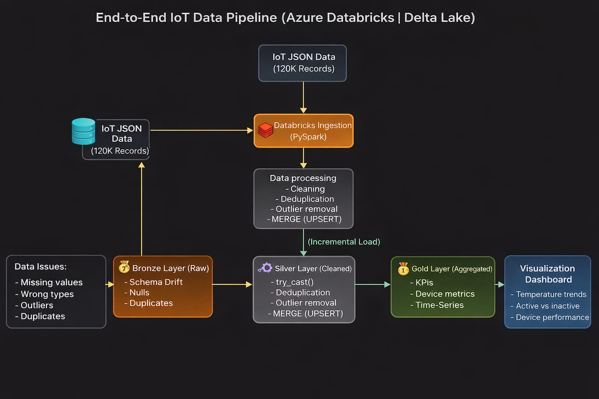
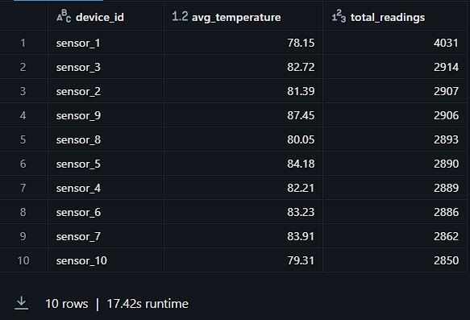
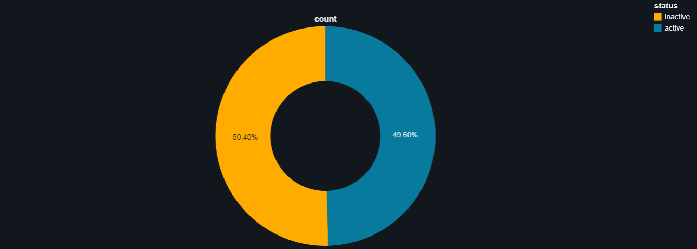
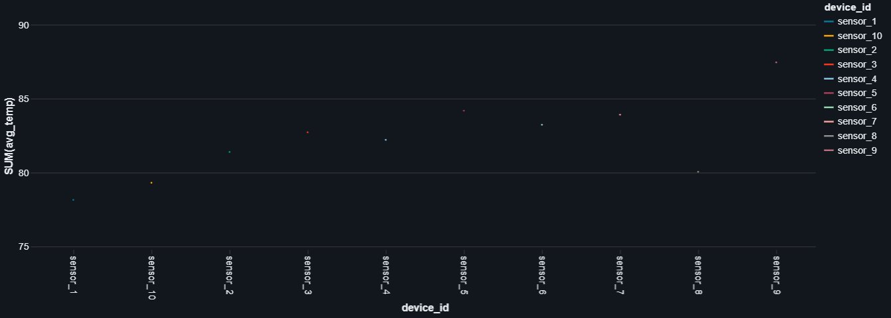

# 🚀 IoT Data Engineering Pipeline (Azure Databricks)

---

## 📌 Overview

This project implements an **end-to-end IoT data pipeline** to process and analyze large-scale sensor data using **Azure Databricks + Delta Lake**.

It follows the **Medallion Architecture (Bronze → Silver → Gold)** to transform messy, real-world IoT data into **high-quality, analytics-ready datasets**.

---

## 🧠 Problem Statement

Modern IoT systems generate massive volumes of **semi-structured JSON data**, which often contain:

- ❌ Missing values  
- ❌ Incorrect data types  
- ❌ Duplicate records  
- ❌ Outliers and inconsistent readings  
- ❌ Schema drift  

👉 These issues lead to **broken pipelines, unreliable analytics, and poor decision-making**.

---

## 🏗️ Architecture

```
IoT JSON Data
      ↓
Bronze Layer (Raw)
      ↓
Silver Layer (Cleaned & Validated)
      ↓
Gold Layer (Aggregated KPIs)
      ↓
Dashboard (Insights)
```

📁 Architecture Diagram:  


---

## ⚙️ Technologies Used

- Azure Databricks  
- PySpark  
- Delta Lake  
- SQL  

---

## 🔄 Data Pipeline Flow

```
Raw JSON → Bronze → Silver → Gold → Dashboard
```

---

## ⚡ Implementation Details

### 🟤 Bronze Layer (Raw Ingestion)

- Ingested **~120K IoT records**
- Stored raw data for **auditability & traceability**
- Included:
  - Null values  
  - Incorrect data types  
  - Duplicate records  

---

### ⚪ Silver Layer (Data Cleaning & Processing)

- Performed **data validation & transformation**
- Used `try_cast` for safe type handling
- Removed duplicates using:
  device_id + timestamp
- Filtered:
  - Null records  
  - Invalid values  
- Removed outliers for better accuracy  
- Built **incremental pipeline** using Delta `MERGE` (UPSERT)

---

### 🟢 Gold Layer (Business Aggregation)

Created **analytics-ready datasets**:

- 📊 Average temperature per device  
- 📈 Total sensor readings  
- ⚡ Active vs inactive sensors  
- ⏱️ Time-series trends  

---

## 🚀 Key Features

✔ Processed **120K+ IoT records**  
✔ Reduced data quality issues significantly  
✔ Implemented **incremental processing (MERGE)**  
✔ Handled schema evolution using `overwriteSchema`  
✔ Built datasets ready for **BI & dashboards**  

---

## 📈 Results

- Improved overall **data reliability and consistency**
- Eliminated duplicate and corrupt records  
- Enabled **scalable incremental ingestion**
- Delivered structured datasets for **analytics & reporting**

---

## 📊 Dashboard & Outputs

### 🟡 Gold Layer Aggregation



---

### 🔵 Active vs Inactive Devices



---

### 🟢 Temperature Trends



---

## 🧠 Learnings

- Handling **schema drift** in semi-structured data  
- Designing scalable pipelines using **Medallion Architecture**  
- Implementing **incremental data processing** with Delta Lake  
- Managing **real-world data quality challenges**  

---

## 🔮 Future Improvements

- ⚡ Real-time streaming (**Kafka / Event Hub**)  
- 🔄 Pipeline orchestration (**Airflow / Azure Data Factory**)  
- 📊 BI integration (**Power BI / Tableau**)  

---

## ⭐ Final Outcome

> **Messy IoT Data → Scalable Pipeline → Reliable Business Insights**

---

## 👨‍💻 Author

**VS Vidyasagar**  
 
